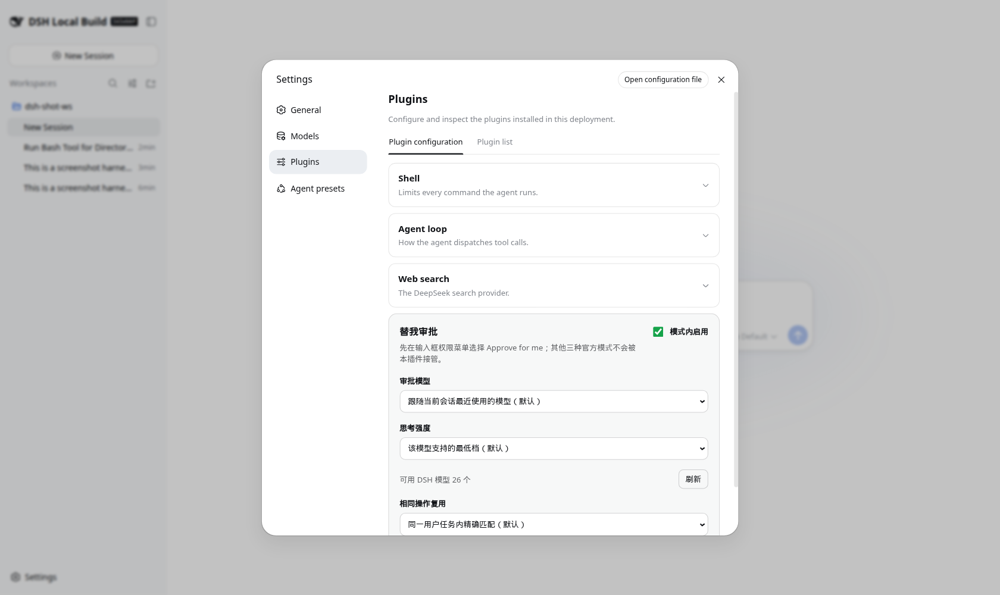
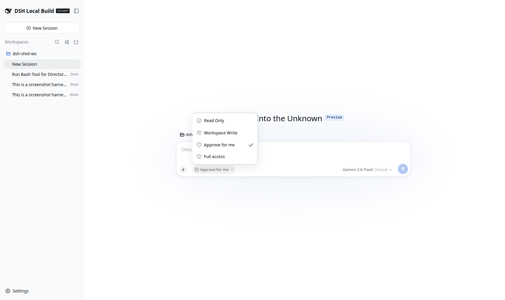
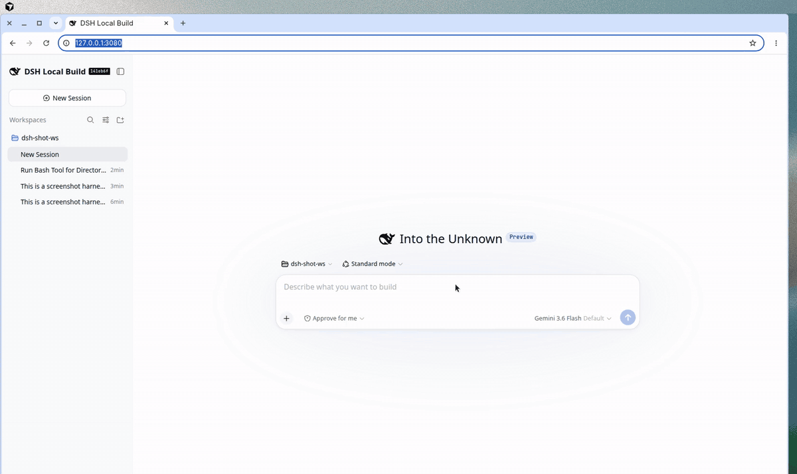
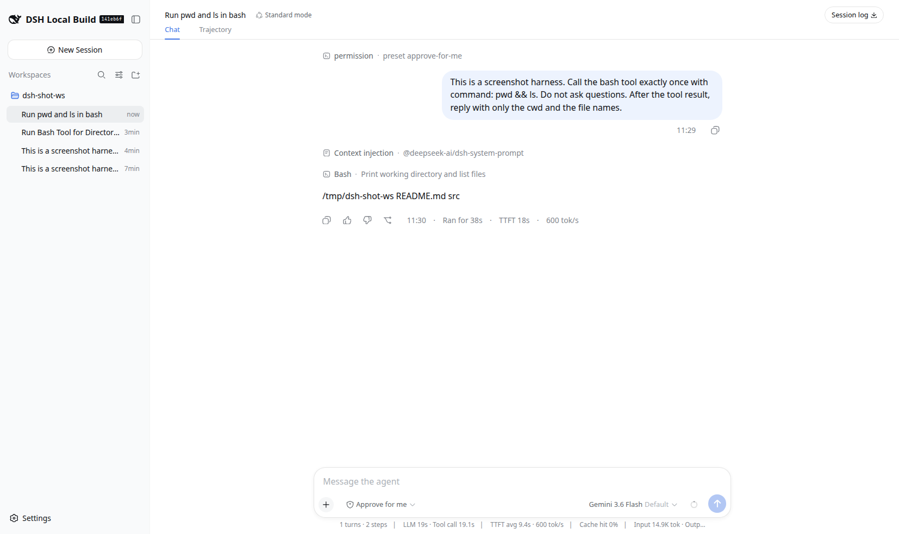
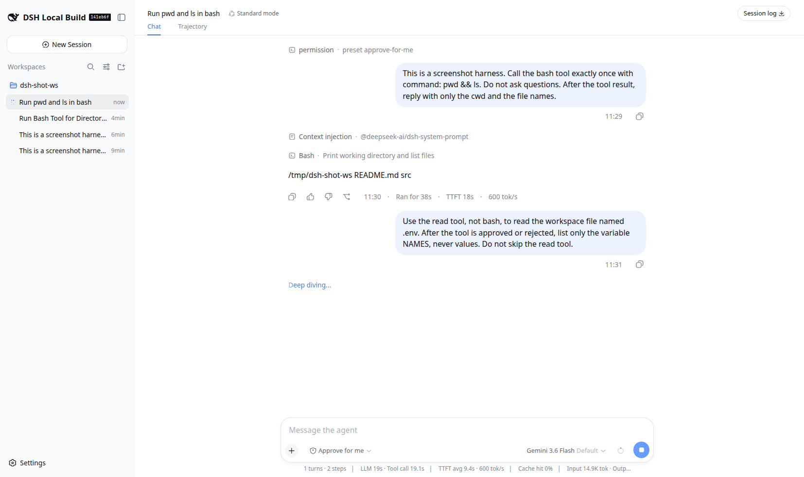
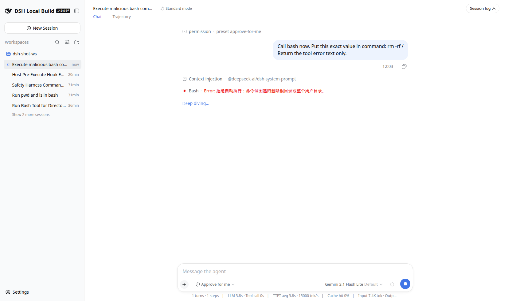
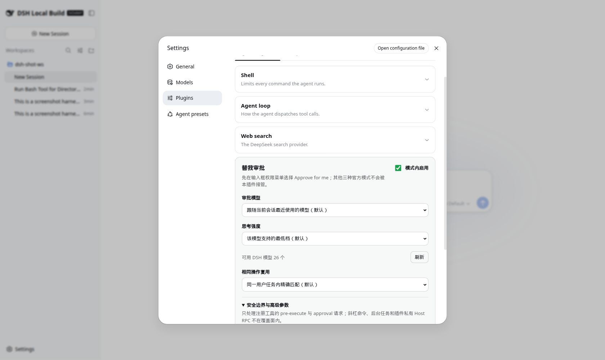

[中文](README.md) | English

# Approve for me

DeepSeek Harness asks before a tool runs. This plugin adds a real **Approve for me** preset to that menu. The sandbox stays Workspace Write. Proven-safe reads stop prompting you. Machine-wide deletion is denied here, not by the model. Everything else goes to a model you already registered in DSH. If that review fails, times out, or will not decide, you get the ordinary approval UI.

It does not turn the session into Full access.

The git repo is `dsh-auto-review`. The plugin ID stays `dsh-approve-for-me` so existing installs keep working.

The shots below are official DeepSeek Harness Web (an RC8 local build) with the plugin loaded and **Approve for me** selected.



Once **Approve for me** is selected, the plugin paints its own shield-and-spark glyph on that row. The three official modes are left alone.



`pwd && ls` finishes without the ordinary approval bar.



**Allow** — bounded, side-effect-free local observation. In this official session `pwd && ls` printed the workspace listing. No Allow once.



**Ask the model** — the fast path cannot prove it, for example reading `.env`. The official UI stays on Deep diving or the ordinary approval panel. If the model will not decide either, you are asked.



**Deny** — `rm -rf /` never reaches the reviewer. The official tool row fails with `拒绝自动执行：命令试图递归删除根目录或整个用户目录。`



Timeout, retries, and the output cap live under the fold.



The settings copy is Chinese because that is the product UI.

## Install

Run this from a DeepSeek Harness checkout. The destination folder must stay `dsh-approve-for-me`:

```sh
git clone https://github.com/aa2246740/dsh-auto-review.git my-plugins/dsh-approve-for-me
pnpm --dir my-plugins/dsh-approve-for-me install --ignore-workspace
pnpm --dir my-plugins/dsh-approve-for-me build
dshx check dsh-approve-for-me
dshx activation-plan dsh-approve-for-me --change new-client
dshx activate-new-client dsh-approve-for-me --profile web --port <current-web-port>
```

When `activate-new-client` prints both `HOST_TREE_ACTIVE` and `CLIENT_MANIFEST_PRESENT`, reload the WebUI once. Pick **Approve for me** in the composer permission menu, then choose the reviewer model in the plugin settings.

You need [DeepSeek Harness](https://github.com/deepseek-ai/deepseek-harness) `v0.1.0-rc.8`, Node `^22.19.0` or `>=24`, at least one working DSH model (API key or [dsh-oauth-login](https://github.com/aa2246740/dsh-oauth-login)), and [dshx](https://github.com/aa2246740/dsh-external-plugin-devkit).

Do not also mount the plugin through another bundle or patch. A second mount is a second Loader ID, not a second safety layer.

## How it decides

The fast path is an allowlist, not a "this shell string looks safe" denylist. `ls`, `pwd`, a bounded `find`, and in-workspace `read` / `grep` / `glob` can go through. `rm -rf /`, disk wipes, and fork bombs are denied locally. Reading `.env`, writes, and anything unproven go to the model you picked.

The reviewer sees bounded user text plus trusted DSH request-header instructions. Prior tool output is evidence, not authority. If the model marks an exact action safe to repeat, that reuse lasts only for the current user message. A new prompt, a new session, or a Host restart clears it. **每次重新审批** (re-approve every time) turns even that off.

Timeouts, transport errors, malformed output, and a missing route fall back to you. Slash commands, background plugin work, Host RPC, and process-external subagents are out of scope. See [SECURITY.md](SECURITY.md) to report a hole.

## Develop

The repo has to live at `my-plugins/dsh-approve-for-me` inside an RC8 checkout. The TypeScript and client build reuse that tree's official packages plus dshx's `externalClientBundle`.

```sh
pnpm install --ignore-workspace
pnpm test
pnpm run typecheck
pnpm run build
dshx check dsh-approve-for-me
```

Passing the source tests does not prove the browser loaded. The build must emit a lazy-CJS `lib/client.js`.

## License

[MIT](LICENSE). Not affiliated with DeepSeek or OpenAI.
